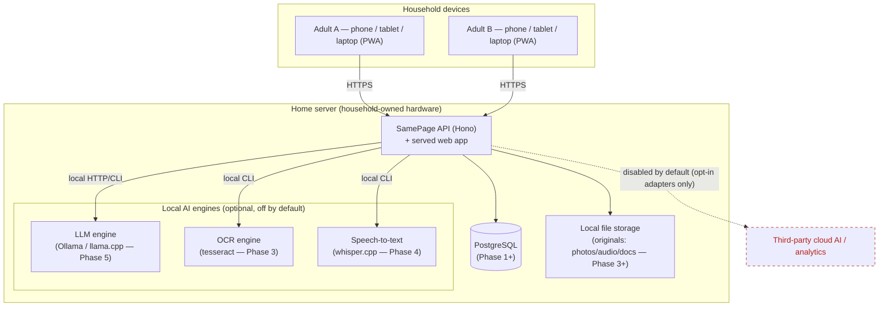

# SamePage — Architecture

This document describes the system as of **Phase 0** and the shape it grows into.
It is kept in sync with the code; where something is not built yet, it says so.

## Guiding principles

- **Local-first & private.** Runs on household-owned hardware. No third-party
  cloud AI, analytics, or telemetry by default. Family content never leaves the
  home system unless the owner explicitly enables an optional adapter later.
- **Capture first, organise later.** The user captures; the system proposes
  structure; a human approves before authoritative records are created.
- **Simplest thing that works.** A modular monolith, not microservices. New
  infrastructure is added only when a documented need justifies it.
- **Never trust model output.** Every AI result is schema-validated and routed
  through human review; it never writes directly to authoritative tables.

## Stack (see ADR 0001)

| Concern            | Choice                                               |
| ------------------ | ---------------------------------------------------- |
| Language           | TypeScript everywhere                                |
| Web app            | Vite + React (mobile-first PWA)                      |
| API                | Hono on Node (modular monolith)                      |
| Validation         | Zod at every trust boundary                          |
| Database (Phase 1) | PostgreSQL + versioned migrations (ADR 0003)         |
| Vectors            | None yet; `pgvector` only if justified (ADR 0004)    |
| AI                 | `ModelProvider` abstraction; Fake default (ADR 0002) |
| Unit/integration   | Vitest                                               |
| End-to-end         | Playwright                                           |
| Tooling            | ESLint + Prettier + `tsc` (strict)                   |

## Repository layout

```
samepage/
├─ apps/
│  ├─ api/                 # Hono modular-monolith backend
│  │  └─ src/
│  │     ├─ ai/            # ModelProvider abstraction + Fake provider (ADR 0002)
│  │     ├─ health/        # Health domain (pure functions)
│  │     ├─ routes/        # HTTP routes (adapters over the domain)
│  │     ├─ app.ts         # Hono app factory (testable via app.request)
│  │     ├─ config.ts      # Zod-validated env config, safe defaults
│  │     └─ index.ts       # Node server entry; serves web in production
│  └─ web/                 # Vite + React PWA (mobile-first)
│     ├─ public/           # manifest + icons
│     └─ src/
│        ├─ lib/           # framework-free helpers (health, status wording)
│        ├─ App.tsx        # home shell
│        └─ main.tsx       # entry
├─ docs/
│  ├─ prd.md               # product requirements
│  ├─ architecture.md      # this file
│  ├─ threat-model.md      # threat model (draft, evolves through Phase 9)
│  └─ adr/                 # architecture decision records
├─ e2e/                    # Playwright end-to-end tests
├─ scripts/                # tooling (secret scan)
├─ docker-compose.yml      # local Postgres for Phase 1+ (not needed in Phase 0)
└─ (workspace + tooling config at root)
```

## System context (Phase 0 → target)



In **Phase 0**, only the API + served web app + the health endpoint exist; the
database, file storage, and AI engines are documented seams, not yet wired.

## Runtime topology

- **Development:** Vite serves the web app on `:5173` and proxies `/api/*` to the
  Hono API on `:8787`. Run both with `pnpm dev`.
- **Production (home server):** the web app is built to static assets and the
  Hono API serves them from the **same origin and port** alongside `/api/*`.
  One process, one port (`pnpm build && pnpm start`). This mirrors what the e2e
  suite exercises.

## Data flow — capture → review → authoritative record (target)

This is the core product loop; Phase 0 lays the seams, later phases fill it in.

```mermaid
sequenceDiagram
  autonumber
  actor U as Household adult
  participant W as Web PWA
  participant API as API (Hono)
  participant ST as File storage
  participant Q as Job queue (Phase 3+)
  participant AI as ModelProvider (Fake now; local engine later)
  participant DB as PostgreSQL

  U->>W: Add Something (text / photo / voice)
  W->>API: POST capture
  API->>ST: store original (photo/audio/doc)
  API->>DB: create Inbox item (state: uploaded) + activity event
  API-->>W: confirmation (item id, status)
  API->>Q: enqueue processing job (idempotent)
  Q->>AI: run operation (OCR / transcribe / extract)
  AI-->>Q: AiResult envelope (validated, with confidence)
  Q->>DB: store PROPOSAL (never an authoritative record)
  U->>W: open Needs Review
  W->>API: fetch proposals
  API-->>W: proposals + original + uncertainty
  U->>W: edit / approve / reject
  W->>API: approve item(s)
  API->>DB: create authoritative record(s) + activity event (who/when/source)
```

Key invariants (enforced as each phase lands):

- The **original** capture is always preserved, even if downstream AI fails.
- AI produces **proposals**; authoritative tasks/appointments/decisions/contacts
  are only created by an explicit human approval, which is recorded with
  provenance (who approved, when, from which source).
- Jobs are **idempotent**; duplicate submissions do not create duplicate
  authoritative records.
- Every household-scoped query enforces **household isolation** server-side.

## Health & observability (Phase 0)

`GET /api/health` returns a structured report — overall status, service,
version, environment, timestamp, uptime, and a list of individual checks
(worst-status-wins roll-up). The web shell calls it and shows a plain-language
connection indicator ("Connected to your home system"). Domain logic lives in
pure functions (`health/health.ts`) so it is deterministic and unit-tested;
the route is a thin adapter. Checks (database, storage, AI availability) are
added as those subsystems come online.

## Security posture (Phase 0, grows through Phase 9)

- `hono/secure-headers` applies safe default response headers.
- Config is validated with Zod; the app runs with safe local-first defaults and
  no secrets in code. A secret-scanning check (`pnpm check:secrets`) guards
  commits.
- No family content, note bodies, transcriptions, or tokens are written to logs.
- Authentication, session security, household isolation, CSRF, and rate limiting
  are implemented starting in Phase 1; secure remote access is designed and
  gated in Phase 9. See `threat-model.md`.
