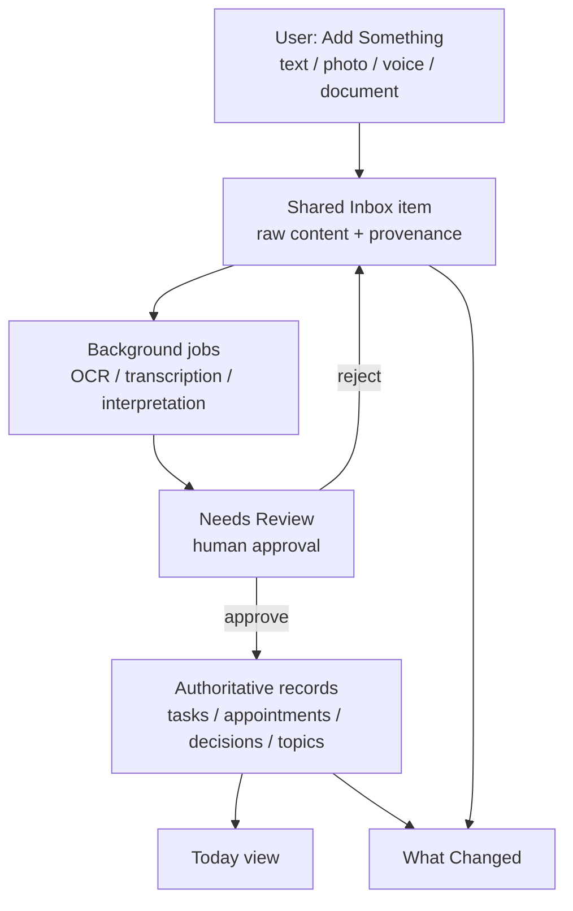

# Initial Data Flow — SamePage

## Phase 0 reality

Phase 0 does **not** implement this flow. It establishes the modular monolith shell and documents the intended path so later phases can add inbox, jobs, and review without rewriting the product shape.

## Provenance rule (future phases)

Original captures (text, images, audio) must be preserved even when downstream AI fails. AI output creates proposals first; authoritative writes happen only after human approval (unless a later trusted automation is explicitly enabled).
