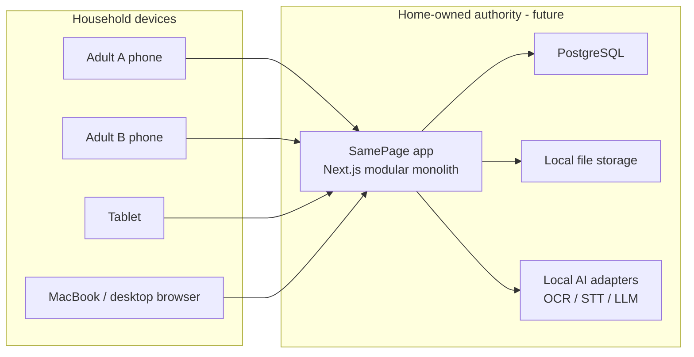

# System Context — SamePage

## Phase 0 scope note

In Phase 0 only the **application shell** and **health-check** exist. PostgreSQL, file storage, authentication, and local AI engines are designed but not implemented.

## Trust boundary

- Family content stays on household-controlled systems by default.
- No third-party AI, analytics, or paid hosted services in the default path.
- Cursor/cloud development environments may build and test code but are not the production data plane.
